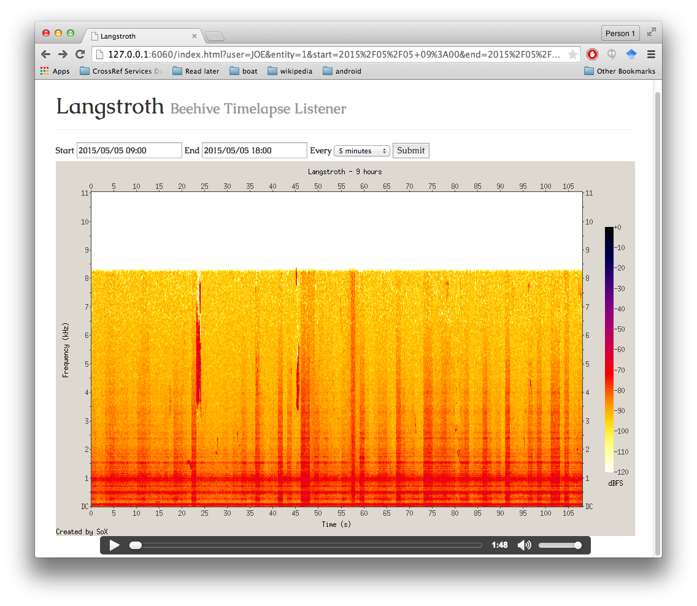

# Langstroth

Server to accept uploads from [Langstroth](https://github.com/afandian/langstroth) Android app.

This will currently accept recordings of any length, but truncate them to 1 second WAVs. This is because:
1. the Android recording system appears to have some kind of adjustment about a second in, so it needs to be skipped
2. SoX can't splice MP3s without a hiccup, so we need to store WAVs
3. and WAVs are huge (44k/sec) so they need cutting down.

Uses SoX to splice sound files and generate spectrograms.

Work in progress.

## License

Copyright © 2015 Joe Wass

Distributed under the Eclipse Public License either version 1.0 or (at
your option) any later version.
